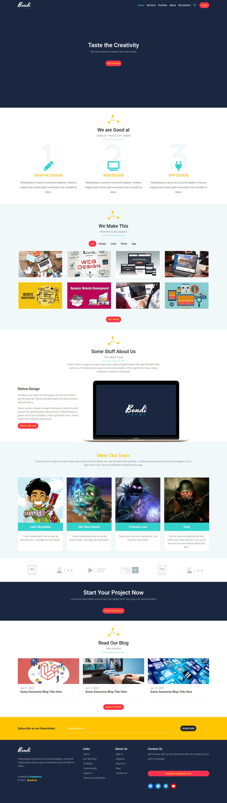

# bondi with Bootstrap

## Table of contents

- [Overview](#overview)
    - [features](#features)
  - [preview](#preview)
  - [Links](#links)
- [Built with](#built-with)
- [Author](#author)

## Overview

a responsive webpage that was built with HTML, CSS, JS, and Bootstrap

### features
- responsive on mobile
- responsive navbar that shows the active class you are in right now
- navbar will disappear if you are not scrolling for a while
- there is a filter in the portfolio section
- there are active states and hover states
    

### preview

### Links

- Solution URL: [Github repo](https://github.com/mohamedkhaled4053/bondi-with-Bootstrap)
- Live Site URL: [Github page](https://mohamedkhaled4053.github.io/bondi-with-Bootstrap/)

## Built with

- Semantic HTML5 markup
- CSS custom properties
- Flexbox
- grid
- Mobile-first workflow
- JavaScript
- Bootstrap

## Author

- Upwork - [Mohamed khaled](https://www.upwork.com/freelancers/~01a5a737ea63245d57)
- Github - [mohamed khaled](https://github.com/mohamedkhaled4053)
- linkedin - [mohamed khaled](https://www.linkedin.com/in/mohamed-khaled-58602722b/)
